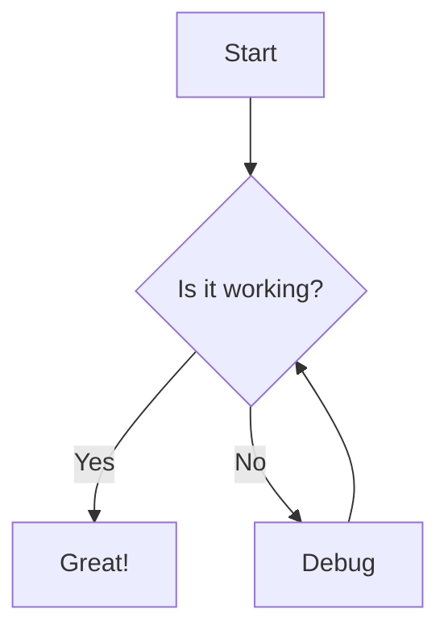

# Sample

## How to Add a Markdown Table

Add a Markdown block and use the following syntax:

```markdown
| Column 1 | Column 2 | Column 3 |
| -------- | -------- | -------- |
| Cell 1   | Cell 2   | Cell 3   |
| Cell 4   | Cell 5   | Cell 6   |
```

## How to Add a Mermaid Diagram

Add a Markdown block and use the following syntax:



## How to Add Callout Boxes

Add a Markdown block and use the following syntax:

```markdown
> [INFO] Here's an informational callout.

> [WARNING] Be careful with this!

> [TIP] Here's a helpful suggestion.

> [NOTE] Remember this for later.

> [ERROR] Something critical to avoid.
```

## How to Add Latex Equations

In the Ghost editor, directly add the Latex code:

```latex
# equation
$$E = mc^2 $$

# equation with number
$$E = mc^2 \numberthis$$

# tag with something else
$$\int_{-\infty}^{\infty} e^{-x^2} dx = \sqrt{\pi} \tag{Gaussian}$$
```

## How to Use Side-by-Side Images

To add images side by side with captions, you'll need to use HTML in the Ghost editor:

1. In the Ghost editor, click the "+" button to add a card
2. Select "HTML" or "Raw HTML" card
3. Paste the following HTML template:

```html
<div class="kg-image-gallery">
  <div class="kg-image-gallery-item">
    
    <div class="kg-image-gallery-caption">Caption for the first image</div>
  </div>
  
  <div class="kg-image-gallery-item">
    
    <div class="kg-image-gallery-caption">Caption for the second image</div>
  </div>
</div>
```